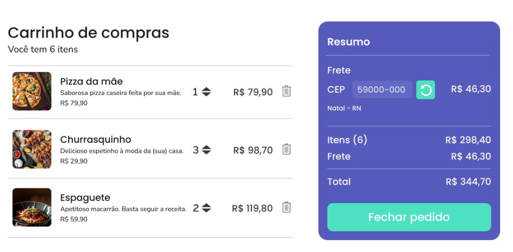

# Carrinho de Compras

Esta tarefa consiste em desenvolver um carrinho de compras em ReactJS. Você irá criar uma aplicação em que os usuários poderão visualizar produtos listados no carrinho, remover itens, ajustar a quantidade de produtos e visualizar um resumo do carrinho com quantidade de cada item e preço total.

## Requisitos Funcionais

O sistema deve permitir ao usuário:

1. Visualizar a lista de produtos no carrinho, incluindo informações como quantidade e preço de cada item.
2. Remover um produto do carrinho.
3. Alterar a quantidade de um produto no carrinho.
4. Ver um resumo do carrinho, incluindo a quantidade de cada item, seu preço individual e o preço total da compra.

Exemplo de layout (**use sua criatividade**)


## Orientações

- Você deverá obter os produtos a serem listados no carrinho de uma API fake.
- Inicie o json-server para simular a API fake dos produtos:

    ```bash
    npx json-server data.json
    ```

   O `data.json` está na raiz do projeto e contém os dados dos produtos. Certifique-se de que o json-server está rodando na porta 3000.
- O endpoint que retorna a lista de produtos para ser consumido é: `http://localhost:3000/products`.

## Execução

Siga os passos abaixo para configurar o projeto em sua máquina local:

1. Clone este repositório em sua máquina local:

    ```bash
    git clone https://github.com/pedrolucas27/treinamento-ic-frontend.git
    cd treinamento-ic-frontend
    ```

2. Instale as dependências do projeto:

    ```bash
    npm install
    ```

4. Inicie o aplicativo React:

    ```bash
    npm run dev
    ```

   A aplicação será executado no endereço `http://localhost:5174/`.
